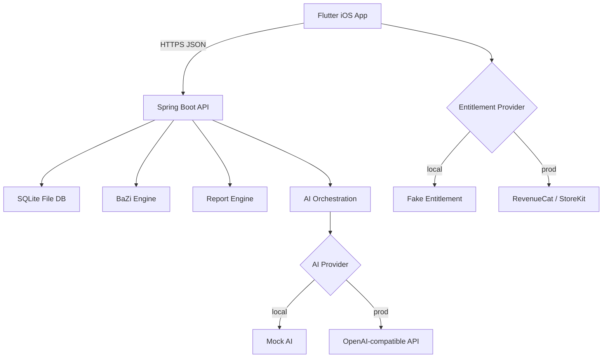

# 01. Architecture

## 1. 总体架构



## 2. 架构原则

### 2.1 单体模块化

本地阶段不做微服务。后端是一个 Spring Boot 单体，但代码按领域模块拆分：

- auth
- profile
- bazi
- report
- ai
- relationship
- subscription
- journal
- settings

每个模块包含：

```text
controller/
service/
repository/
dto/
model/
```

### 2.2 Port/Adapter

所有外部不稳定依赖必须通过接口隔离：

```text
AiProvider
EntitlementProvider
AuthProvider
NotificationProvider
CalendarProvider
```

本地实现与生产实现并存：

```text
MockAiProvider
OpenAiCompatibleProvider
FakeEntitlementProvider
RevenueCatEntitlementProvider
DevAuthProvider
AppleAuthProvider
```

### 2.3 计算与生成分离

BaZi chart 由确定性引擎生成。LLM 不允许计算 chart，只能解释后端给出的结构化 JSON。

```text
Birth data → BaZi deterministic chart → Insight mapping → AI natural language
```

### 2.4 本地优先

开发者执行：

```bash
cd backend && ./mvnw spring-boot:run
cd app && flutter run
```

即可完整跑通。

## 3. 环境配置

### Backend profiles

```text
local      默认，本地 SQLite + mock AI + dev auth
staging    SQLite/Postgres 均可 + real AI + sandbox IAP
production  production DB + real AI + real IAP + Apple auth
```

本 SDD 只要求实现 local，并预留 staging/production adapter。

### Backend env

```bash
APP_PROFILE=local
SERVER_PORT=8080
SQLITE_PATH=./data/pillarwise.db
AI_PROVIDER=mock
AI_BASE_URL=
AI_API_KEY=
AI_MODEL=
```

### Flutter env

```dart
const String apiBaseUrl = String.fromEnvironment(
  'API_BASE_URL',
  defaultValue: 'http://127.0.0.1:8080',
);

const String appFlavor = String.fromEnvironment(
  'APP_FLAVOR',
  defaultValue: 'local',
);
```

运行：

```bash
flutter run --dart-define=API_BASE_URL=http://127.0.0.1:8080 --dart-define=APP_FLAVOR=local
```

iOS simulator 访问本机可以用 `http://127.0.0.1:8080`。

## 4. API 统一格式

成功：

```json
{
  "success": true,
  "data": {},
  "meta": {
    "requestId": "req_xxx",
    "serverTime": "2026-06-01T12:00:00Z"
  }
}
```

失败：

```json
{
  "success": false,
  "error": {
    "code": "VALIDATION_ERROR",
    "message": "Birth time is invalid.",
    "details": {}
  },
  "meta": {
    "requestId": "req_xxx",
    "serverTime": "2026-06-01T12:00:00Z"
  }
}
```

## 5. 数据流

### 5.1 Birth profile 创建

```text
Flutter form
→ validation
→ POST /api/v1/birth-profiles
→ backend validate
→ save birth_profile
→ calculate chart
→ save bazi_chart
→ return profile + chart summary
```

### 5.2 Blueprint 生成

```text
Flutter requests preview/full
→ report service checks entitlement
→ loads chart
→ insight mapper builds structured sections
→ AI provider creates polished copy if enabled
→ saves report
→ returns card list
```

### 5.3 AI Guide

```text
User message
→ client quota check
→ backend loads user profile + chart + memory
→ safety pre-check
→ prompt assembly
→ AI provider
→ safety post-check
→ save message
→ update memory summary
→ return answer cards
```

## 6. 错误分类

| Code | HTTP | 前端表现 |
|---|---:|---|
| VALIDATION_ERROR | 400 | 表单字段下方错误 |
| UNAUTHORIZED | 401 | 回到登录/dev session |
| ENTITLEMENT_REQUIRED | 402 | 展示 paywall |
| NOT_FOUND | 404 | Empty state + 返回 |
| RATE_LIMITED | 429 | 说明限额 + 升级按钮 |
| AI_UNAVAILABLE | 503 | 降级为模板回答或重试 |
| INTERNAL_ERROR | 500 | 友好错误 + report id |

## 7. 性能目标

| 操作 | 目标 |
|---|---:|
| App cold start 到 Welcome | < 1.8s |
| 本地 profile 创建 | < 500ms |
| BaZi chart 计算 | < 300ms |
| Blueprint preview | < 2s mock / < 8s real AI |
| AI answer | < 2s mock / < 10s real AI |
| 页面滑动 | 60fps |
| Crash-free sessions | > 99% |

## 8. 安全边界

- 本地 dev token 可简单实现，但 production 必须替换为 Apple Sign-In token 验证。
- 不在 Flutter 中存明文 API key。
- AI provider key 只在后端环境变量。
- Birth data 属于敏感画像数据，删除账号时必须删除。
- 日志不输出完整出生日期、出生时间、聊天内容。
